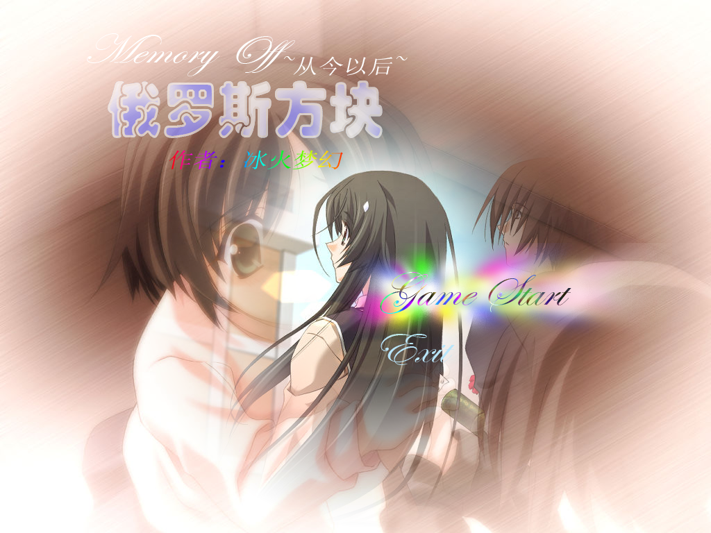
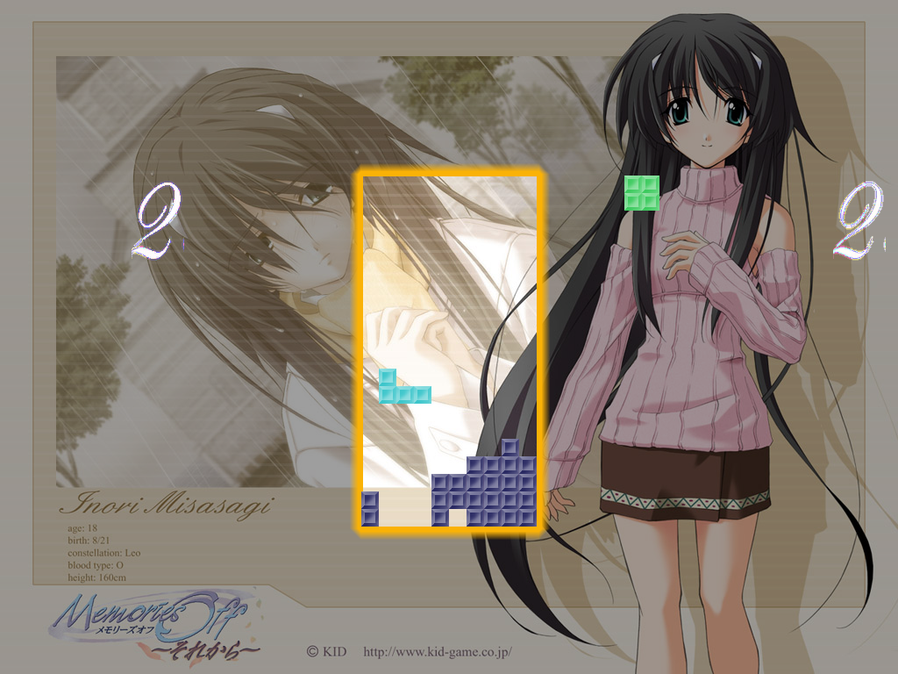
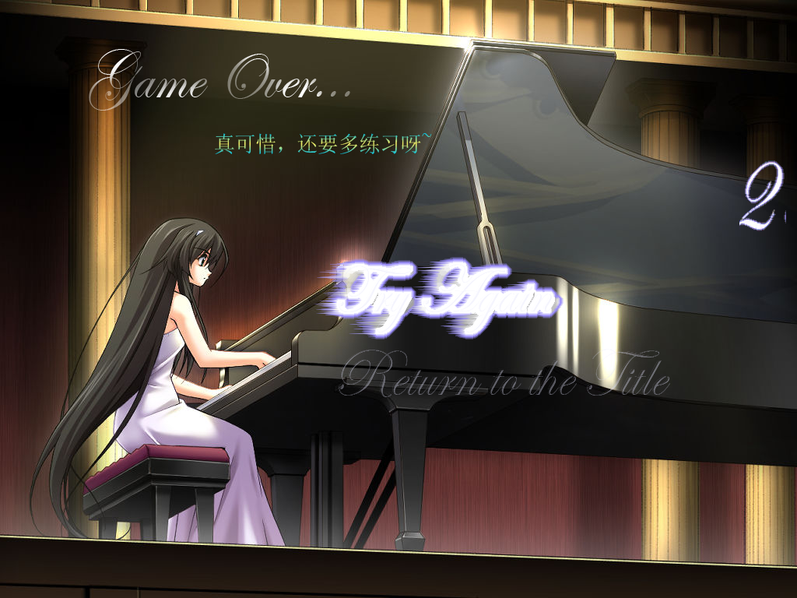

# cube

一款用C++开发的俄罗斯方块游戏。

只使用了标准Windows GUI库，没有使用任何第三方图形库。





这是我2006年9月开发完成的。

## 编译方法

用Visual Studio打开`Combat.sln`，根据VS的版本自动转换后，直接编译即可。

## 游戏方法

A和S为旋转，左、右、下键为移动，上键为旋转，完全符合QQ游戏的键位。
在运行时，P键为暂停键，数字小键盘的+-号为加速和减速，最高速度为每秒下落99格，最低速度为每秒下落1格，根据系统资源和配置，最高速度可能达不到每秒99格。
ESC键在游戏运行时可以到达结束画面，在开始和结束画面可以退出程序。

## 设置方法

本游戏的特色在于高度的自我定制功能，玩家可以自由设置方块种类、方块颜色、背景图片和背景音乐。
方块属性在文本文件BlockInfo.dat中。第一行为总方块数，最多可以设16种，目前已经有经典的7种。
第二行开始，格式为：
方块尺寸x（方块变形时，能容纳下方块的一个正方形边长，最小为1，最大为5），方块变形种类y（可以任意设定，最小为1，无最大限制）
接着是一个数（0~15）表示方块颜色，可以在BMP文件夹下的Grid.bmp找到，最左为0，最右为15
下面是方块的按顺序的各种形态，用y个x见方字符方阵表示，其中#表示方块，.表示空白。
例如下面是长条型的设计：

```
4 2	//长条型要4*4的方阵描述，有两种形态
0	//长条形用第0种颜色
....	//第一种长条型
####
....
....
..#.	//第二种长条形
..#.
..#.
..#.
```

当然，想设计一个能从长条变成方块再变成T字的方块很容易：

```
4 4
0
....	//第一种长条型
####
....
....
..#.	//第二种长条形
..#.
..#.
..#.
....	//方块
.##.
.##.
....
....	//T字
.###
..#.
..#.
```

游戏运行时的背景图片在MO_BMP文件夹下，背景音乐在MO_BGM文件夹下。可随意替换。

之所以用MO前缀是因为当时我正沉迷于于Galgame[秋之回忆4~从今以后~](https://baike.baidu.com/item/%E7%A7%8B%E4%B9%8B%E5%9B%9E%E5%BF%864%EF%BC%9A%E4%BB%8E%E4%BB%8A%E4%BB%A5%E5%90%8E)。

